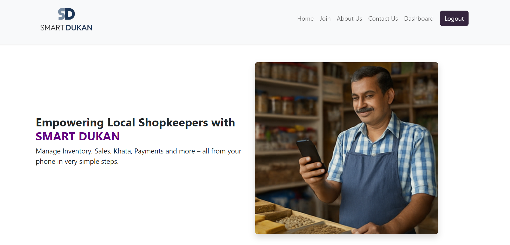
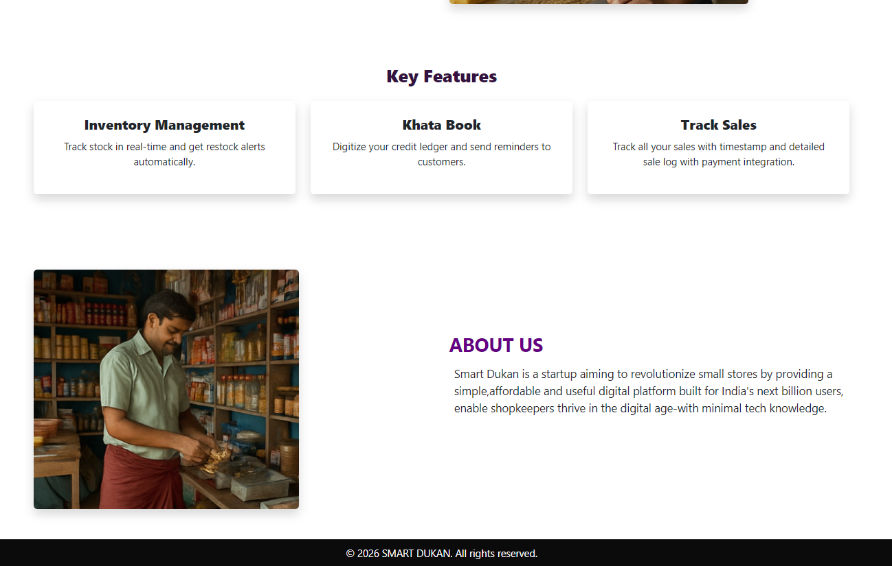
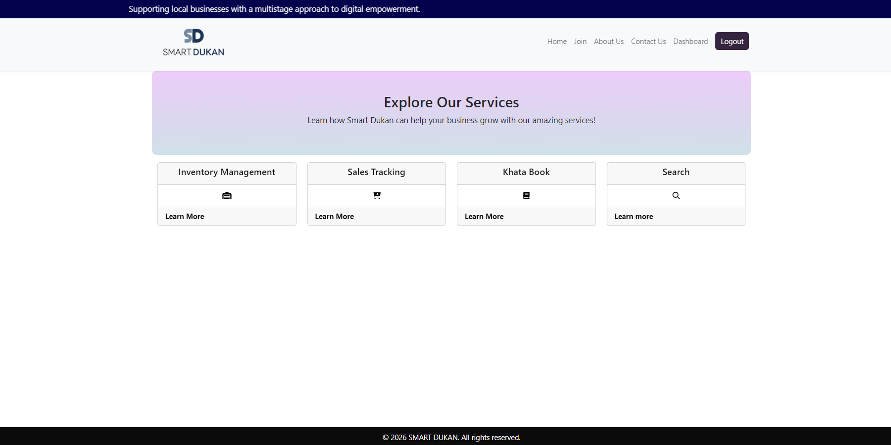
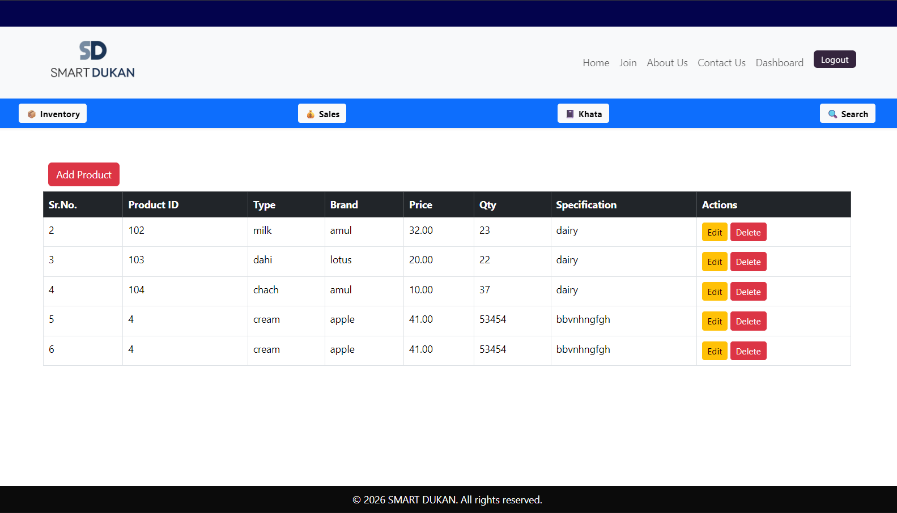
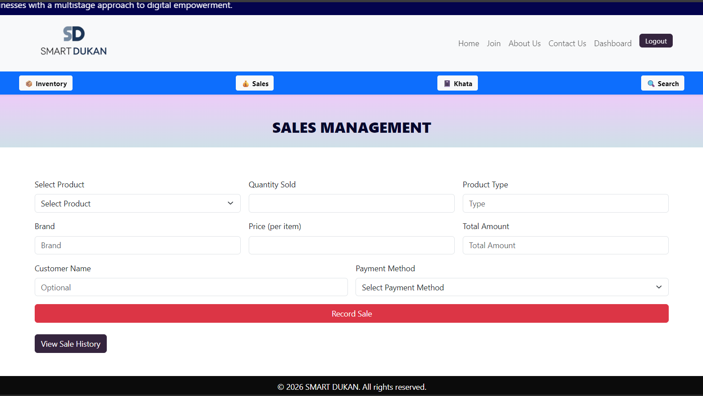
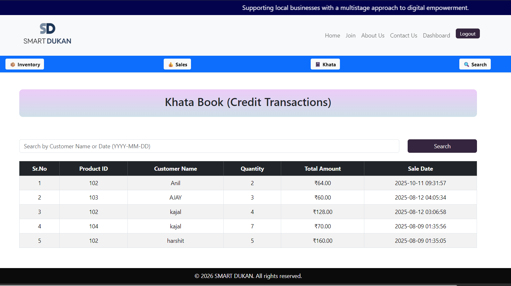
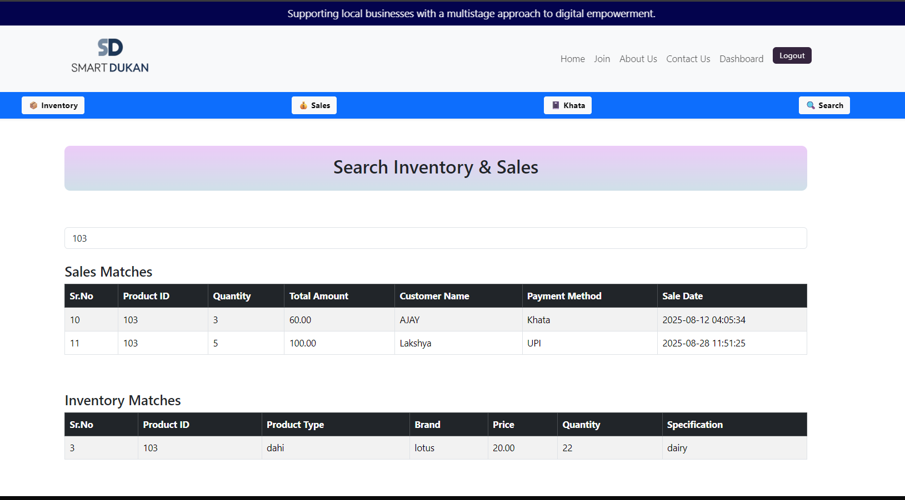

# 🛒 SmartDukan – Inventory Management System for Local Shops

## 🚀 Overview

SmartDukan is a web-based inventory management system designed for small and medium local shop owners.
It helps shopkeepers manage stock, track sales, and maintain customer records digitally — replacing traditional manual methods.

---
🌐 Live Demo: https://smartdukan.gt.tc
---

## 🎯 Problem Statement

Most local shop owners still rely on notebooks (khatabook) to manage:

* Inventory
* Sales
* Customer credit

This leads to:

* Data loss
* Poor tracking
* No analytics

---

## 💡 Solution

SmartDukan provides a simple digital platform where shop owners can:

* Manage inventory in real-time
* Track sales and transactions
* Maintain khatabook (credit records)
* Search products instantly

---

## ✨ Features

### 🔐 Authentication System

* User login & logout
* Secure session handling
* Password reset & verification

### 📦 Inventory Management

* Add / update / delete products
* Track stock levels
* Fetch product details dynamically

### 💰 Sales Management

* Record daily sales
* Maintain transaction history

### 📒 Khatabook System

* Manage customer credit
* Track dues and payments

### 📬 Contact System

* Contact form with email integration (PHPMailer)

### 🔍 Search Functionality

* Quick product search

---

## 🛠 Tech Stack

**Frontend:**

* HTML
* CSS
* JavaScript

**Backend:**

* PHP

**Database:**

* MySQL

**Libraries:**

* PHPMailer

---

## 📁 Project Structure

```bash
smartdukan/
│
├── assets/           # CSS, JS, images
├── config/           # Database configuration
├── includes/         # Reusable components (navbar, footer)
├── modules/          # Core functionalities
├── pages/            # UI pages
├── vendor/           # External libraries
```

---

## ⚙️ Installation & Setup

### 1️⃣ Clone the repository

```bash
git clone https://github.com/pip-lakshya/smartdukan.git
```

### 2️⃣ Move to XAMPP htdocs

```bash
C:/xampp/htdocs/smartdukan
```

### 3️⃣ Start server

* Start Apache & MySQL from XAMPP

### 4️⃣ Setup database

* Create a database in phpMyAdmin
* Import the provided SQL file

### 5️⃣ Run the project

```bash
http://localhost/smartdukan
or 
https://smartdukan.gt.tc/
```

---
## 🔐 Configuration

1. Go to config folder  
2. Copy `config.sample.php`  
3. Rename it to `config.php`  
4. Add your database credentials  

## 📸 Screenshots








---

## 🚀 Future Improvements

* 📊 Analytics dashboard
* 🤖 AI-based demand prediction
* 📱 Mobile app version
* 🔔 Low stock alerts
* ☁️ Cloud deployment

---

## 👨‍💻 Author

**Lakshya Bhandari**

---

## ⭐ Contribution

Feel free to fork this repo and contribute!

---

## 📌 Note

This project is built for learning and practical implementation purposes.
